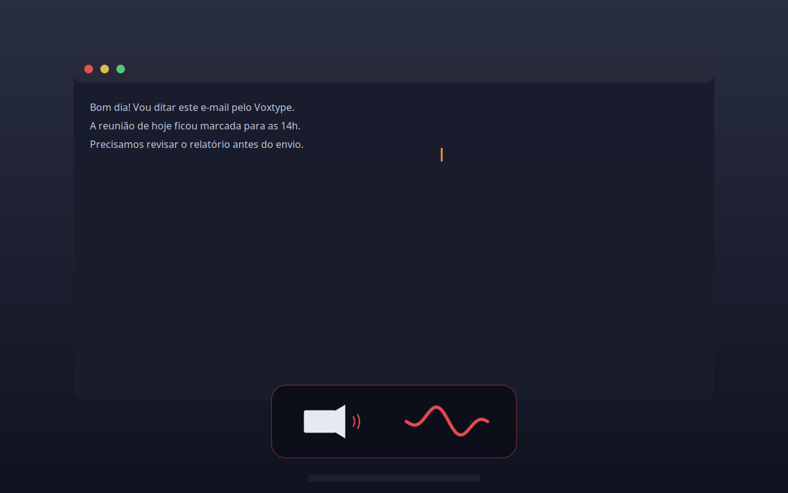

<p align="center">
  
</p>

<h1 align="center">FrancosVox 🇧🇷</h1>

<p align="center">
  <b>Ditado por voz (voice-to-text) em tempo real no Linux</b><br/>
  Português do Brasil • GPU (Vulkan) • GNOME Wayland • OSD com onda senoidal animada
</p>

<p align="center">
  <a href="LICENSE"></a>
  <a href="https://github.com/woheller69/voxtype"></a>
  
  
  
</p>

---

## ✨ O que é

**FrancosVox** transforma o [Voxtype](https://github.com/woheller69/voxtype) em um
sistema de ditado completo para **Português do Brasil**:

1. Pressione `Ctrl+Shift+Espaço` — aparece o **OSD com speaker + onda senoidal** que se move conforme a sua voz
2. Fale normalmente
3. Pressione `Ctrl+Shift+Espaço` de novo — o texto é transcrito **na GPU** e **colado no cursor**, na caixa de diálogo onde você estava

| 🎙 Ouvindo (a onda reage à voz) | ⏳ Transcrevendo |
|---|---|
|  |  |

---

## ✅ O que este projeto resolve

| Problema do Voxtype original | Solução do FrancosVox |
|---|---|
| Modelo `.en` — transcrição ruim em pt-BR | `large-v3-turbo` + `language = "pt"` (multilíngue) |
| Transcrição na CPU demora 70s+ | **GPU Vulkan** (AMD/NVIDIA/Intel) — 6,5s de áudio transcritos em **~0,7s** |
| `wtype` falha no GNOME Wayland ("virtual keyboard protocol not supported") e **travava a colagem por ~1 minuto** | `wtype` removido; colagem via **ydotool + clipboard** em ~1,5s |
| Sem feedback visual de gravação | **OSD na tela**: speaker + onda senoidal animada conforme o volume da voz |
| Texto cola na janela errada | OSD **click-through, sem foco** (`accept_focus=False`), nunca rouba a caixa de diálogo |
| Teclas ABNT2 saem trocadas (`;` vira `:`) | Colagem **atômica via Ctrl+V** (nenhuma tecla é digitada) |
| Atalho morto após o reboot | **Autostart do daemon** no login + atalho que **auto-recupera** o daemon |
| 2º toque ignorado / disparo duplo | Wrapper `voxtype-toggle` com debounce e trava durante a transcrição |

---

## 🖥️ Demonstração

O OSD fica ancorado na **parte inferior central** da tela — pequeno, nunca cobre
a caixa de diálogo e **não rouba o foco**:

- 🔴 **Ouvindo** — o speaker pulsa e a onda cresce conforme o volume da sua voz
- 🔵 **Transcrevendo** — borda azul pulsante + onda animada
- Some automaticamente quando idle

> O overlay usa `Gtk.WindowTypeHint.NOTIFICATION`, `set_accept_focus(False)` e
> input region vazia (click-through): cliques e foco **atravessam** o OSD.

---

## 📦 Componentes

| Arquivo | Função |
|---|---|
| `bin/voxtype-osd` | Overlay GTK3 com speaker + onda senoidal animada (lê o socket de áudio do daemon) |
| `config/config.toml` | Configuração pt-BR: GPU, modelo, colagem atômica, delay de foco |
| `scripts/voxtype-start` | Inicia o daemon com o binário Vulkan (GPU) e mata duplicados |
| `scripts/voxtype-toggle` | Wrapper do atalho: debounce, trava na transcrição, auto-recuperação do daemon |
| `scripts/setup-gnome-shortcut.sh` | Registra `Ctrl+Shift+Espaço` no GNOME |
| `scripts/apply.sh` | Sincroniza o repo → sistema (config, OSD, atalho, autostart) |
| `scripts/voxtype-autoupdate.sh` | Auto-update no login (pull + apply) |
| `whisper-http-server.js` | API HTTP `/transcribe` (opcional, para integrações) |

---

## 🚀 Instalação

### 1. Voxtype + dependências

```bash
# Voxtype (0.7.1+)
wget https://github.com/woheller69/voxtype/releases/latest/download/voxtype_amd64.deb
sudo dpkg -i voxtype_amd64.deb && sudo apt-get install -f

# Dependências do sistema
sudo apt install ydotool wl-clipboard python3-gi python3-gi-cairo gir1.2-gtk-3.0 python3-cairo

# Modelo pt-BR (large-v3-turbo, ~1,6 GB)
voxtype setup --download --model large-v3-turbo
```

> ⚠️ **Remova o `wtype`** se instalado: ele é incompatível com o GNOME Wayland e
> fazia a colagem travar por ~1 minuto:
> ```bash
> sudo apt remove wtype
> ```

### 2. Este repositório

```bash
git clone https://github.com/FrancosCorporation/FrancosVox.git ~/Git/voxtype-br
cd ~/Git/voxtype-br
bash scripts/apply.sh        # instala config, OSD, atalho, autostart e inicia o daemon
```

### 3. ydotool (injeção de teclas no Wayland)

```bash
sudo usermod -aG input $USER   # acesso ao /dev/uinput (logout/login)
sudo nohup ydotoold -o $USER:$USER -P 0666 > /tmp/ydotoold.log 2>&1 &
```

### 4. GPU (opcional, recomendado)

O `scripts/voxtype-start` detecta e usa `/usr/lib/voxtype/voxtype-vulkan`
automaticamente. Confirme no log:

```
ggml_vulkan: Found 1 Vulkan devices:
ggml_vulkan: 0 = AMD Radeon RX 6750 XT (RADV NAVI22) (radv)
whisper_init_with_params_no_state: use gpu = 1
```

---

## 🎤 Como usar

1. Clique na caixa de texto (chat, e-mail, formulário…)
2. **`Ctrl+Shift+Espaço`** → OSD vermelho aparece ("Ouvindo...")
3. Fale naturalmente — o OSD reage à sua voz
4. **`Ctrl+Shift+Espaço`** → OSD azul ("Transcrevendo...") e o texto é colado no cursor
5. Se cair na janela errada: clique na caixa certa e dê `Ctrl+V` (o texto continua no clipboard)

> Durante a transcrição **não clique em outro lugar** — o texto cola na janela
> focada no momento da colagem.

---

## ⚙️ Configuração essencial

```toml
[whisper]
model = "large-v3-turbo"   # melhor equilíbrio pt-BR: qualidade × velocidade
language = "pt"
gpu_isolation = false      # modelo fica na memória (sem recarregar a cada ditado)

[output]
mode = "paste"             # colagem atômica via Ctrl+V (instantânea, ABNT2 seguro)
driver_order = ["ydotool", "clipboard"]
pre_type_delay_ms = 600    # tempo para soltar o atalho e o foco assentar
```

---

## 🧩 Requisitos

- Ubuntu 24.04+ / GNOME Wayland (X11 também funciona)
- Voxtype 0.7.1+ ([.deb](https://github.com/woheller69/voxtype/releases))
- `ydotool` + daemon `ydotoold` (injeção de teclas)
- GPU com driver Vulkan (recomendado) — AMD: `mesa-vulkan-drivers`

---

## 🔍 Solução de problemas

| Sintoma | Causa / Fix |
|---|---|
| Atalho não faz nada após reboot | O daemon não subiu — o atalho agora **inicia sozinho** (`voxtype-toggle`); ou rode `bash scripts/voxtype-start` |
| Colagem demora ~1 min | `wtype` instalado (quebrado no GNOME) → `sudo apt remove wtype` |
| Texto cola na janela errada | OSD agora é click-through e sem foco; aguarde o OSD azul sumir antes de clicar |
| Transcrição lenta (CPU 100%) | Confira que `voxtype-start` está usando o binário Vulkan (`grep -i vulkan /tmp/voxtype.log`) |
| Caracteres ABNT2 trocados | `mode = "paste"` resolve (nenhuma tecla é digitada) |

Mais detalhes em [docs/TROUBLESHOOTING.md](docs/TROUBLESHOOTING.md).

---

## 🛠️ Desenvolvimento

```bash
git pull && bash scripts/apply.sh   # aplica mudanças do repo no sistema
tail -f /tmp/voxtype.log            # logs do daemon
python3 docs/generate_screenshots.py  # regenera os screenshots do README
```

---

## 🙏 Créditos

- [Voxtype](https://github.com/woheller69/voxtype) — ferramenta base de ditado push-to-talk
- [whisper.cpp](https://github.com/ggerganov/whisper.cpp) — motor de transcrição local (GPU Vulkan)

## 📄 Licença

MIT — use, modifique e compartilhe à vontade.